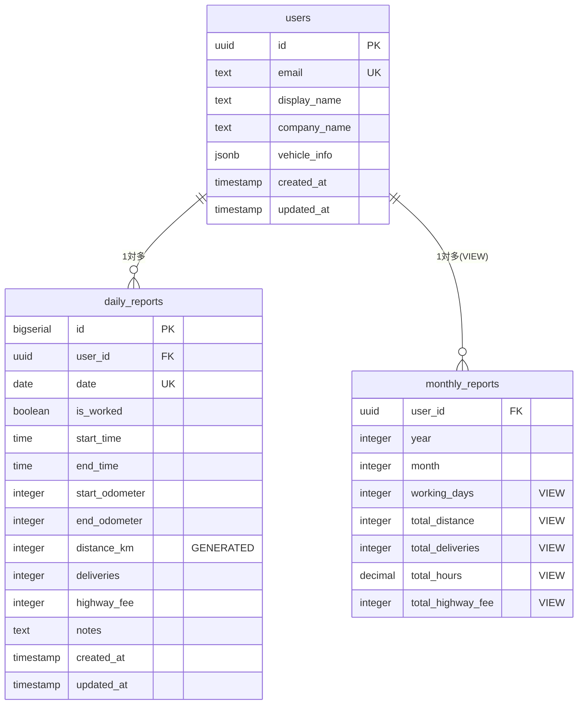

# Driver Logbook - 転職活動用ポートフォリオ資料

## 📋 プロジェクト概要

### 🎯 プロジェクト名

**Driver Logbook v3** - 委託ドライバー業務効率化アプリ

### 🌟 成果物（デモリンク）

- **本番環境**: [https://driverlogbook-seven.vercel.app](https://driverlogbook-seven.vercel.app)
- **GitHub**: [https://github.com/eight42910/driver_logbook](https://github.com/eight42910/driver_logbook)

### 🎯 開発背景・課題設定

委託軽貨物ドライバーの業務効率化を目的とした、日報管理システムの開発。

**解決したい課題**:

- 紙ベースの日報記録による非効率性
- 月次レポート作成の手間（従来 1 時間 → 5 分に短縮）
- データ管理・分析の困難さ
- ドライバー特有の業務フローへの対応

**ターゲットユーザー**:

- プライマリ: 委託軽貨物ドライバー（個人事業主）
- セカンダリ: 事務担当・発注元

---

## 🏗️ 技術スタック・アーキテクチャ

### フロントエンド

```typescript
// 主要技術スタック
{
  "framework": "Next.js 14.2 (App Router)",
  "language": "TypeScript 5.x",
  "styling": "Tailwind CSS + shadcn/ui",
  "forms": "React Hook Form + Zod",
  "state": "React Context + useReducer",
  "icons": "Lucide React",
  "date": "date-fns",
  "charts": "Recharts"
}
```

### バックエンド・インフラ

```typescript
{
  "database": "Supabase (PostgreSQL)",
  "auth": "Supabase Auth (JWT)",
  "api": "Supabase Auto-generated REST API",
  "security": "Row Level Security (RLS)",
  "storage": "Supabase Storage",
  "hosting": "Vercel",
  "domain": "Vercel Domains"
}
```

### エクスポート・PDF 機能

```typescript
{
  "pdf": "jsPDF (日本語フォント対応)",
  "csv": "PapaCSV (UTF-8 BOM対応)",
  "compression": "html2canvas",
  "formats": ["基本形式", "詳細形式", "経理用形式"]
}
```

### アーキテクチャ図

```mermaid
graph TB
    subgraph "フロントエンド（Vercel）"
        A[Next.js 14 + TypeScript]
        B[shadcn/ui + Tailwind CSS]
        C[React Hook Form + Zod]
    end

    subgraph "バックエンド（Supabase）"
        D[PostgreSQL DB]
        E[Auth (JWT)]
        F[Row Level Security]
        G[Auto REST API]
    end

    subgraph "エクスポート機能"
        H[jsPDF（PDF生成）]
        I[PapaCSV（CSV生成）]
    end

    A --> E
    A --> G
    C --> D
    A --> H
    A --> I
    F --> D
```

---

## 🚀 実装した主要機能

### ✅ Phase 1-2: コア機能（MVP）

| 機能                | 技術的特徴            | 実装内容                                                 |
| ------------------- | --------------------- | -------------------------------------------------------- |
| **ユーザー認証**    | Supabase Auth + RLS   | ログイン・登録・プロフィール自動作成・エラーハンドリング |
| **日報 CRUD**       | TypeScript + Zod      | 作成・編集・削除・一覧表示・バリデーション               |
| **ダッシュボード**  | React Context + hooks | 月間統計・KPI 可視化・最近の日報表示                     |
| **レスポンシブ UI** | Tailwind CSS          | モバイル・タブレット・デスクトップ完全対応               |

### ✅ Phase 3: 高度な機能

| 機能               | 技術的挑戦             | 実装詳細                                       |
| ------------------ | ---------------------- | ---------------------------------------------- |
| **PDF 出力**       | jsPDF + 日本語フォント | 美しい月次レポート PDF 生成、自動ページ分割    |
| **CSV 出力**       | PapaCSV + UTF-8 BOM    | 3 形式対応（基本・詳細・経理用）、Excel 互換性 |
| **月次レポート**   | PostgreSQL View + 集計 | 年月選択・統計自動計算・リアルタイム表示       |
| **データ自動計算** | Generated Column       | 距離自動計算（メーター越えロジック含む）       |

---

## 💻 技術的な挑戦と解決

### 1. データベース設計の工夫

**課題**: ドライバー特有の業務データ（距離計算、時間管理）の効率的管理

**解決策**:

```sql
-- 距離自動計算（メーター越え対応）
distance_km INTEGER GENERATED ALWAYS AS (
  CASE
    WHEN end_odometer >= start_odometer
      THEN end_odometer - start_odometer
    WHEN end_odometer < start_odometer
      THEN (999999 - start_odometer) + end_odometer + 1
    ELSE 0
  END
) STORED
```

**技術的価値**:

- PostgreSQL の Generated Column 活用
- エッジケース（メーター巻き戻り）への対応
- パフォーマンス最適化（事前計算）

### 2. TypeScript 型安全性の徹底

**課題**: Supabase との型整合性確保

**解決策**:

```typescript
// データベース型定義からの自動生成
export interface Database {
  public: {
    Tables: {
      daily_reports: {
        Row: DailyReport;
        Insert: Omit<
          DailyReport,
          'id' | 'distance_km' | 'created_at' | 'updated_at'
        >;
        Update: Partial<
          Omit<DailyReport, 'id' | 'distance_km' | 'created_at' | 'updated_at'>
        >;
      };
    };
  };
}
```

**技術的価値**:

- 完全な型安全性
- ランタイムエラーの事前検出
- リファクタリング時の安全性確保

### 3. 認証システムの堅牢性

**課題**: 認証エラー・ネットワーク障害への対応

**解決策**:

```typescript
// プロフィール自動作成 + リトライ機能
const loadUserProfile = useCallback(async (user: User) => {
  try {
    // 既存プロフィール取得試行
    const existingProfile = await fetchProfile(user.id);
    if (existingProfile) {
      setProfile(existingProfile);
    } else {
      // 自動作成
      const newProfile = await createUserProfile(user);
      setProfile(newProfile);
    }
  } catch (error) {
    // エラー時のリトライ + フォールバック
    const fallbackProfile = await createUserProfile(user);
    setProfile(fallbackProfile);
  }
}, []);
```

**技術的価値**:

- 障害耐性の高い認証フロー
- ユーザー体験の最適化
- エラーハンドリングの体系化

### 4. エクスポート機能の実用性

**課題**: 実際の業務で使えるファイル形式での出力

**解決策**:

```typescript
// UTF-8 BOM付きCSV（Excel互換）
const BOM = '\uFEFF';
const csv = Papa.unparse(csvData, {
  header: false,
  delimiter: ',',
  newline: '\r\n',
  quoteChar: '"',
  escapeChar: '"',
});
return BOM + csv;
```

**技術的価値**:

- 文字エンコーディング問題の解決
- 複数フォーマット対応（基本・詳細・経理用）
- 実際の業務フローに適合

---

## 📊 データベース設計

### ERD と関係性



### セキュリティ設計

```sql
-- Row Level Security ポリシー
CREATE POLICY "Users can only access own reports"
  ON daily_reports FOR ALL
  USING (auth.uid() = user_id);

-- 月報ビューの権限制御
CREATE POLICY "Users can only view own monthly reports"
  ON monthly_reports FOR SELECT
  USING (auth.uid() = user_id);
```

---

## 🎨 UI/UX 設計

### デザインシステム

- **コンポーネント**: shadcn/ui（Radix UI ベース）
- **スタイリング**: Tailwind CSS（ユーティリティファースト）
- **アイコン**: Lucide React（軽量・統一感）
- **レスポンシブ**: Mobile First 設計

### ページ構成

```
📱 モバイル最適化
├── 🏠 ダッシュボード（統計・KPI表示）
├── 📝 日報入力（直感的フォーム）
├── 📋 日報一覧（検索・フィルター）
├── 📊 月次レポート（年月選択・エクスポート）
└── ⚙️ 設定（プロフィール・車両情報）
```

### ユーザビリティの工夫

- **入力効率化**: 前回メーター値自動設定
- **エラー防止**: リアルタイムバリデーション
- **視覚的フィードバック**: 距離自動計算表示
- **操作性**: ワンクリックエクスポート

---

## 📈 開発プロセス・品質管理

### 開発手法


### 品質保証

| 項目               | 手法・ツール           | 実装状況 |
| ------------------ | ---------------------- | -------- |
| **型安全性**       | TypeScript strict mode | ✅ 完了  |
| **コード品質**     | ESLint + Next.js 規約  | ✅ 完了  |
| **バリデーション** | Zod スキーマ           | ✅ 完了  |
| **セキュリティ**   | Supabase RLS + JWT     | ✅ 完了  |
| **パフォーマンス** | Next.js 最適化         | ✅ 完了  |

### Git 管理・デプロイ

- **ブランチ戦略**: Git Flow（develop 中心）
- **CI/CD**: Vercel 自動デプロイ
- **本番環境**: https://driverlogbook-seven.vercel.app
- **環境分離**: 本番・プレビュー環境完全分離

---

## 🎯 技術的成果・学習

### 習得・深化した技術

#### 1. **Next.js 14 App Router**

- Server/Client Components 適切な使い分け
- 新しいルーティングシステムの活用
- パフォーマンス最適化手法

#### 2. **TypeScript 型安全性**

- Supabase との完全型統合
- Zod によるランタイムバリデーション
- 複雑な型定義の設計

#### 3. **Supabase フルスタック開発**

- PostgreSQL 高度機能（Generated Column、RLS）
- 認証システムの堅牢な実装
- リアルタイム機能の活用

#### 4. **実用的なエクスポート機能**

- jsPDF 日本語対応 PDF の生成
- 複数形式 CSV 出力の実装
- ファイルエンコーディング問題の解決

### 解決した技術的課題

| 課題                 | 解決手法                   | 技術的価値       |
| -------------------- | -------------------------- | ---------------- |
| **メーター巻き戻り** | Generated Column + CASE 文 | エッジケース対応 |
| **文字化け**         | UTF-8 BOM 対応             | 実用性重視       |
| **認証エラー**       | リトライ + フォールバック  | 障害耐性         |
| **型安全性**         | TypeScript + Zod           | 開発効率向上     |

---

## 🚀 プロジェクトの価値・成果

### ビジネス価値

- **作業時間短縮**: 月報作成 1 時間 → 5 分（92%削減）
- **データ活用**: 手作業集計からデジタル分析へ
- **ユーザビリティ**: 直感的操作による継続利用促進

### 技術的価値

- **モダンスタック**: 最新技術による保守性・拡張性
- **型安全性**: TypeScript 活用による品質向上
- **セキュリティ**: RLS 活用による堅牢なデータ保護
- **実用性**: 実際の業務フローに適合した機能設計

### 今後の展開可能性

- **PWA 対応**: オフライン機能・プッシュ通知
- **AI 機能**: 収支予測・最適化提案
- **チーム機能**: 複数ドライバー管理
- **API 連携**: 他システムとの統合

---

## 📞 デモ・質疑応答

### 📱 ライブデモ

1. **認証フロー**: 登録・ログイン・プロフィール自動生成
2. **日報作成**: 直感的入力・リアルタイム計算
3. **ダッシュボード**: 統計表示・データ可視化
4. **エクスポート**: PDF・CSV 出力（複数形式）

### 🔧 技術的詳細説明

- コードリーディング（主要コンポーネント）
- アーキテクチャ詳細解説
- データベース設計の意図
- セキュリティ考慮事項

### 💡 改善・拡張案の議論

- 追加機能提案
- パフォーマンス最適化
- ユーザー体験向上
- スケーラビリティ対応

---

**📊 開発期間**: 約 6 週間（2024 年 12 月〜2025 年 1 月）  
**👨‍💻 開発者**: 個人開発  
**🔗 GitHub**: [https://github.com/eight42910/driver_logbook](https://github.com/eight42910/driver_logbook)  
**🚀 本番環境**: [https://driverlogbook-seven.vercel.app](https://driverlogbook-seven.vercel.app)

---

_最終更新: 2025 年 1 月 17 日_
