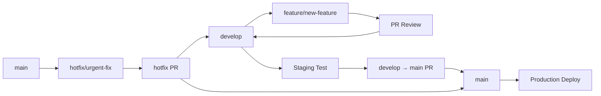

# GitHub ワークフロー - Driver Logbook v3

## 🌿 Git Flow ブランチ戦略

### 基本方針

**Git Flow ベースの develop 中心戦略** - スケーラブルで安全な開発フロー

### ブランチ構成

```
main      ← 本番環境（絶対にいじらない）
├─ develop  ← 開発統合ブランチ（開発の中心）
│   ├─ feature/auth-system
│   ├─ feature/ui-mobile-optimization
│   └─ feature/reporting-system
└─ hotfix/  ← 緊急修正ブランチ
```

### ブランチ詳細

#### 🏆 main ブランチ

- **役割**: 本番環境・リリース済み安定版
- **保護**: 直接コミット完全禁止
- **更新**: develop からのマージのみ（リリース時）
- **デプロイ**: **本番環境に自動デプロイ**

#### 🚀 develop ブランチ

- **役割**: 開発統合・次期リリース準備
- **GitHub デフォルト**: **このブランチをデフォルトに設定**
- **更新**: feature ブランチからのマージ
- **デプロイ**: **ステージング環境に自動デプロイ**

#### 🔧 feature/ ブランチ

- **命名**: `feature/機能名`
- **例**: `feature/auth-system`, `feature/ui-mobile-optimization`
- **作成元**: develop
- **マージ先**: develop
- **ライフサイクル**: 機能完成時にマージ・削除

#### 🚨 hotfix/ ブランチ

- **役割**: 本番緊急バグ修正
- **命名**: `hotfix/bug-description`
- **作成元**: main
- **マージ先**: main AND develop（両方）

---

## 🚀 デプロイ戦略 & 環境構成

### Vercel デプロイ設定

```
┌─────────────────┬─────────────────┬─────────────────┐
│    ブランチ      │     環境        │   デプロイ       │
├─────────────────┼─────────────────┼─────────────────┤
│ main            │ Production      │ 本番環境        │
│ develop         │ Preview         │ ステージング環境  │
│ feature/*       │ Preview         │ PR確認用        │
└─────────────────┴─────────────────┴─────────────────┘
```

### デプロイタイミング

#### 1. 開発中のテスト

- **ブランチ**: `feature/*`
- **環境**: Vercel Preview (PR 作成時)
- **URL**: `https://driver-logbook-[pr-id].vercel.app`
- **目的**: 機能単体テスト

#### 2. 統合テスト

- **ブランチ**: `develop`
- **環境**: Vercel Preview (継続デプロイ)
- **URL**: `https://driver-logbook-develop.vercel.app`
- **目的**: 全機能統合テスト

#### 3. 本番リリース

- **ブランチ**: `main`
- **環境**: Vercel Production
- **URL**: `https://driverlogbook-seven.vercel.app`
- **目的**: 本番サービス提供

---

## 🔄 日常的な開発フロー

### 1. 機能開発の開始

```bash
# developブランチに移動
git checkout develop
git pull origin develop

# 新しいfeatureブランチを作成
git checkout -b feature/line-reservation-update

# 開発作業...
# ファイル編集、テストなど

# 変更をコミット
git add .
git commit -m "feat: Improve LINE reservation section layout"

# featureブランチをリモートにプッシュ
git push origin feature/line-reservation-update
```

### 2. リモートで develop をデフォルトブランチに設定

**GitHub 上で**：

1. Settings → Branches
2. Default branch を `develop` に変更
3. main ブランチを保護設定（Push protection 有効化）

### 3. 機能完成時のマージ

```bash
# PR作成・レビュー・マージ後
git checkout develop
git pull origin develop
git branch -d feature/line-reservation-update
```

### 4. リリース準備（develop → main）

```bash
# リリース準備が整った時
git checkout main
git pull origin main
git merge develop
git push origin main

# または GitHub上でPR作成
# develop → main のPull Request
```

---

## 📋 GitHub リポジトリ設定

### 必須設定項目

#### 1. デフォルトブランチ変更

```
Settings → Branches → Default branch
develop に変更
```

#### 2. ブランチ保護ルール

**main ブランチ**：

- [ ] Require pull request reviews before merging
- [ ] Dismiss stale PR approvals when new commits are pushed
- [ ] Require status checks to pass before merging
- [ ] Require branches to be up to date before merging
- [ ] Restrict pushes that create files larger than 100MB

**develop ブランチ**：

- [ ] Require pull request reviews before merging
- [ ] Require status checks to pass before merging

#### 3. Auto-merge 設定

- [ ] Allow auto-merge
- [ ] Automatically delete head branches

---

## 🎯 コミットメッセージ規約

### Conventional Commits

```
feat: 新機能追加
fix: バグ修正
docs: ドキュメント更新
style: コードスタイル変更（空白、フォーマット等）
refactor: リファクタリング
test: テスト追加・修正
chore: その他の作業（ビルド、ツール設定等）
perf: パフォーマンス改善
ci: CI/CD設定変更
```

### 具体例

```bash
feat: 日報作成での前回メーター値引き継ぎ機能追加
fix: モバイル検索フィルターの表示不具合修正
docs: GitHub workflow説明を追加
refactor: MainLayoutコンポーネントの責務分離
test: DailyReportFormの単体テスト追加
```

---

## 🚀 Vercel プロジェクト設定

### 環境変数設定

```env
# Production (main)
NEXT_PUBLIC_SUPABASE_URL=prod_url
NEXT_PUBLIC_SUPABASE_ANON_KEY=prod_key

# Preview (develop)
NEXT_PUBLIC_SUPABASE_URL=staging_url
NEXT_PUBLIC_SUPABASE_ANON_KEY=staging_key
```

### Build & Deploy 設定

```json
{
  "buildCommand": "npm run build",
  "outputDirectory": ".next",
  "framework": "nextjs",
  "nodejs": "18.x"
}
```

---

## 📊 ワークフロー可視化

### 理想的なフロー



---

## ❓ FAQ: デプロイに関する疑問解消

### Q1: デプロイは develop で反映？main で反映？

**A**: **両方です！**

- **develop**: ステージング環境（テスト用）
- **main**: 本番環境（ユーザー向け）

### Q2: GitHub のデフォルトブランチは develop にすべき？

**A**: **YES！** 理由：

- PR のデフォルト先が develop になる
- 開発者が間違って main に直接コミットするリスクを回避
- 開発フローが自然になる

### Q3: main ブランチはいつ更新？

**A**: **リリース時のみ**

- 機能が完成し、ステージング環境でテスト完了
- develop → main の PR を作成・マージ
- 自動的に本番環境にデプロイ

### Q4: 緊急バグ修正は？

**A**: **hotfix ブランチ**

- main から hotfix ブランチ作成
- 修正後、main AND develop 両方にマージ
- 本番即座反映 + 開発ブランチにも反映

---

## 🎯 次のアクション

### 今すぐ実行

1. **GitHub 設定変更**

   ```bash
   # ローカルでdevelopブランチ作成・プッシュ
   git checkout -b develop
   git push origin develop
   ```

2. **GitHub UI 設定**

   - Settings → Branches → Default branch → develop
   - main ブランチ保護設定

3. **Vercel 設定確認**
   - develop ブランチのプレビューデプロイ確認
   - 環境変数設定（本番/ステージング分離）

---

_作成日: 2025 年 1 月 17 日_
_次回更新: ワークフロー運用開始後_
