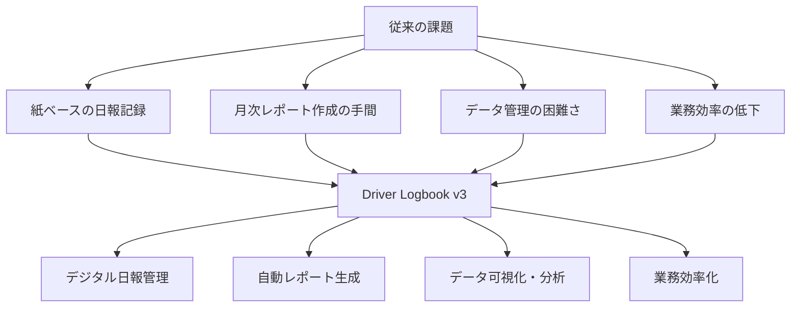
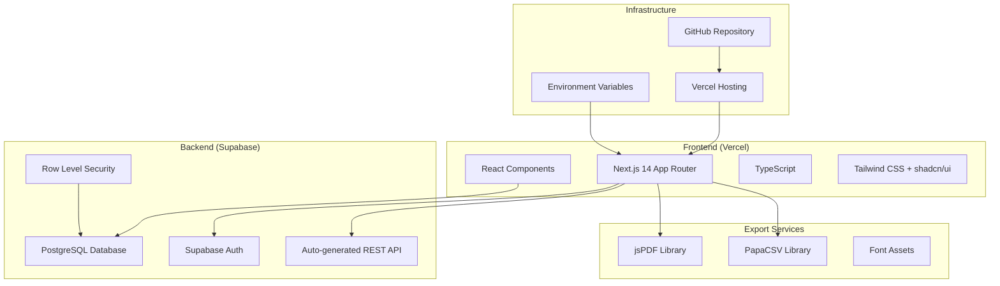
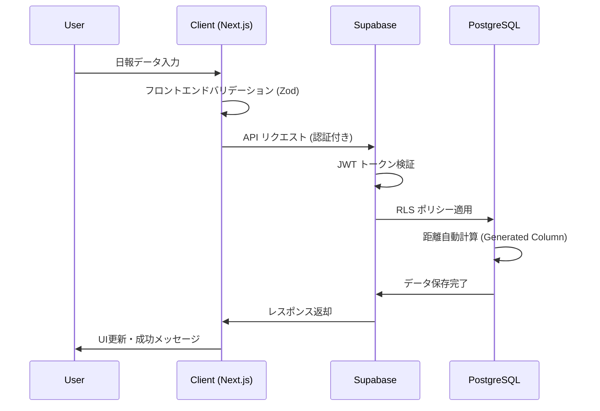
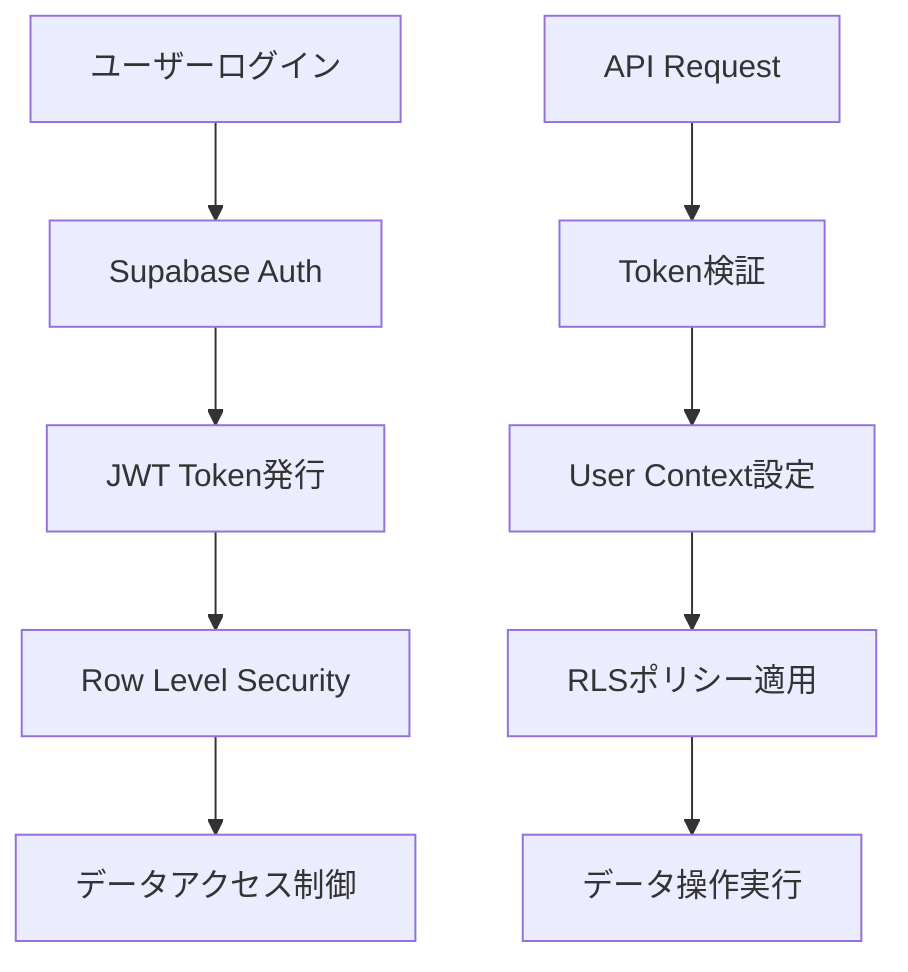
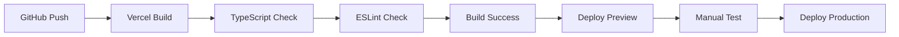
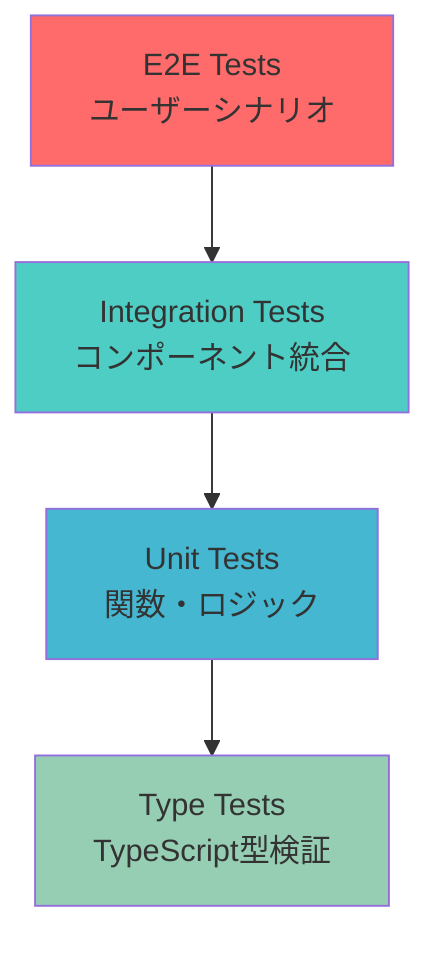
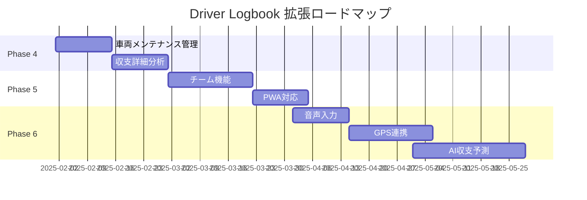

# Driver Logbook v3 - プロジェクト設計・仕様解説書

## 📋 はじめに

このドキュメントは、Driver Logbook v3 プロジェクトの設計思想から技術仕様まで、他の開発者や関係者に説明するための包括的なガイドです。プロジェクトの全体像を理解し、技術的な意思決定の背景を把握することができます。

---

## 🎯 プロジェクト概要

### 解決したい課題

委託軽貨物ドライバーが直面する以下の問題を解決します：



### ターゲットユーザー

| ユーザー分類           | 特徴                 | ニーズ                                 |
| ---------------------- | -------------------- | -------------------------------------- |
| **プライマリユーザー** | 委託軽貨物ドライバー | 日報記録の効率化、月次レポート自動生成 |
| **セカンダリユーザー** | 事務担当・管理者     | データ集計、レポート出力               |
| **将来ユーザー**       | 運送会社・チーム     | 複数ドライバー管理                     |

---

## 🏗️ システム設計思想

### 設計原則

#### 1. **シンプリシティ・ファースト**

```typescript
// 複雑な処理も直感的なAPIで
const report = await createDailyReport({
  date: today,
  isWorked: true,
  startOdometer: 12345,
  endOdometer: 12450,
});
// 距離は自動計算される（105km）
```

#### 2. **段階的な機能拡張**

```
Phase 1: MVP（認証・基本日報）
   ↓
Phase 2: コア機能（CRUD・ダッシュボード）
   ↓
Phase 3: 高度機能（エクスポート・統計）
   ↓
Phase 4+: 拡張機能（チーム・AI）
```

#### 3. **モバイル・ファースト**

```css
/* レスポンシブ設計の基本方針 */
.container {
  /* モバイル（デフォルト） */
  padding: 1rem;

  /* タブレット */
  @media (min-width: 768px) {
    padding: 2rem;
  }

  /* デスクトップ */
  @media (min-width: 1024px) {
    padding: 3rem;
  }
}
```

#### 4. **型安全性の徹底**

```typescript
// データベース⇔アプリケーション間の完全な型安全性
interface DailyReport {
  id: number;
  user_id: string;
  date: string; // YYYY-MM-DD形式
  is_worked: boolean;
  start_odometer?: number;
  end_odometer?: number;
  distance_km: number; // 自動計算される
  deliveries?: number;
  highway_fee?: number;
}
```

---

## 🏛️ システムアーキテクチャ

### 全体構成図



### データフロー



---

## 🛠️ 技術選定理由

### フロントエンド技術スタック

#### Next.js 14 (App Router)

**選定理由**：

- **Server/Client Components**: サーバーサイド処理とクライアントサイド処理の最適な分離
- **ファイルベースルーティング**: 直感的なページ構成
- **パフォーマンス最適化**: 自動的な画像最適化・コード分割
- **開発体験**: ホットリロード・TypeScript 統合

```typescript
// Server Component（データ取得）
export default async function DashboardPage() {
  const reports = await getDailyReports(); // サーバーで実行
  return <DashboardClient reports={reports} />;
}

// Client Component（インタラクション）
('use client');
export function DashboardClient({ reports }: Props) {
  const [filter, setFilter] = useState('all');
  // クライアントサイドの状態管理
}
```

#### TypeScript

**選定理由**：

- **コンパイル時エラー検出**: ランタイムエラーの事前防止
- **開発効率向上**: 強力な型推論・自動補完
- **リファクタリング安全性**: 大規模変更時の安全性確保

```typescript
// 型定義によるAPI契約の明文化
type CreateDailyReportParams = {
  date: string;
  isWorked: boolean;
  startOdometer?: number;
  endOdometer?: number;
};

type CreateDailyReportResponse = {
  data: DailyReport | null;
  error: string | null;
};
```

#### Tailwind CSS + shadcn/ui

**選定理由**：

- **開発速度**: ユーティリティクラスによる高速スタイリング
- **一貫性**: デザインシステムの自動維持
- **カスタマイズ性**: テーマ・コンポーネント変更の柔軟性
- **アクセシビリティ**: Radix UI ベースの高品質コンポーネント

```typescript
// shadcn/uiコンポーネントの例
<Button variant="outline" size="sm" onClick={handleExport} disabled={isLoading}>
  {isLoading ? <Loader2 className="w-4 h-4 animate-spin" /> : <Download />}
  CSV出力
</Button>
```

### バックエンド技術スタック

#### Supabase

**選定理由**：

- **開発速度**: バックエンド機能の即座利用
- **PostgreSQL**: 強力なリレーショナルデータベース
- **リアルタイム機能**: WebSocket 自動対応
- **認証システム**: セキュアな認証の即座実装

```sql
-- PostgreSQLの高度機能を活用
CREATE TABLE daily_reports (
  id BIGSERIAL PRIMARY KEY,
  user_id UUID REFERENCES auth.users(id),
  date DATE UNIQUE,
  start_odometer INTEGER,
  end_odometer INTEGER,
  -- 距離を自動計算（メーター巻き戻り対応）
  distance_km INTEGER GENERATED ALWAYS AS (
    CASE
      WHEN end_odometer >= start_odometer
        THEN end_odometer - start_odometer
      WHEN end_odometer < start_odometer
        THEN (999999 - start_odometer) + end_odometer + 1
      ELSE 0
    END
  ) STORED
);
```

#### Row Level Security (RLS)

**選定理由**：

- **データセキュリティ**: データベースレベルでのアクセス制御
- **実装簡単**: SQL ポリシーによる宣言的セキュリティ
- **パフォーマンス**: データベース内での効率的なフィルタリング

```sql
-- ユーザーは自分のデータのみアクセス可能
CREATE POLICY "Users can only access own data"
ON daily_reports FOR ALL
USING (auth.uid() = user_id);
```

---

## 🗃️ データベース設計

### テーブル設計

#### users テーブル（Supabase Auth 拡張）

```sql
CREATE TABLE users (
  id UUID PRIMARY KEY REFERENCES auth.users(id),
  email TEXT UNIQUE NOT NULL,
  display_name TEXT,
  company_name TEXT,
  vehicle_info JSONB,
  created_at TIMESTAMPTZ DEFAULT NOW(),
  updated_at TIMESTAMPTZ DEFAULT NOW()
);
```

#### daily_reports テーブル（コアテーブル）

```sql
CREATE TABLE daily_reports (
  id BIGSERIAL PRIMARY KEY,
  user_id UUID REFERENCES users(id) ON DELETE CASCADE,
  date DATE NOT NULL,
  is_worked BOOLEAN NOT NULL DEFAULT true,
  start_time TIME,
  end_time TIME,
  start_odometer INTEGER,
  end_odometer INTEGER,
  distance_km INTEGER GENERATED ALWAYS AS (
    CASE
      WHEN end_odometer >= start_odometer
        THEN end_odometer - start_odometer
      WHEN end_odometer < start_odometer
        THEN (999999 - start_odometer) + end_odometer + 1
      ELSE 0
    END
  ) STORED,
  deliveries INTEGER DEFAULT 0,
  highway_fee INTEGER DEFAULT 0,
  notes TEXT,
  created_at TIMESTAMPTZ DEFAULT NOW(),
  updated_at TIMESTAMPTZ DEFAULT NOW(),

  CONSTRAINT unique_user_date UNIQUE(user_id, date)
);
```

### データベース設計の特徴

#### 1. **自動計算フィールド**

```sql
-- Generated Columnによる距離自動計算
distance_km INTEGER GENERATED ALWAYS AS (
  CASE
    WHEN end_odometer >= start_odometer
      THEN end_odometer - start_odometer
    WHEN end_odometer < start_odometer  -- メーター巻き戻り対応
      THEN (999999 - start_odometer) + end_odometer + 1
    ELSE 0
  END
) STORED
```

#### 2. **制約による整合性**

```sql
-- 一人のユーザーが同じ日に複数の日報を作成することを防ぐ
CONSTRAINT unique_user_date UNIQUE(user_id, date)
```

#### 3. **拡張可能な設計**

```sql
-- JSONB型による柔軟な車両情報管理
vehicle_info JSONB  -- { "model": "軽トラック", "plate": "品川123", ... }
```

---

## 🎨 UI/UX 設計

### デザインシステム

#### カラーパレット

```css
:root {
  --primary: 222.2 84% 4.9%; /* ダークネイビー */
  --primary-foreground: 210 40% 98%;
  --secondary: 210 40% 96%; /* ライトグレー */
  --secondary-foreground: 222.2 84% 4.9%;
  --accent: 210 40% 94%; /* アクセントグレー */
  --accent-foreground: 222.2 84% 4.9%;
}
```

#### タイポグラフィ

```css
.typography-h1 {
  @apply text-3xl font-bold tracking-tight;
}
.typography-h2 {
  @apply text-2xl font-semibold tracking-tight;
}
.typography-body {
  @apply text-sm text-muted-foreground;
}
```

### レスポンシブデザイン戦略

#### ブレークポイント設定

```typescript
const breakpoints = {
  sm: '640px', // スマートフォン
  md: '768px', // タブレット
  lg: '1024px', // デスクトップ
  xl: '1280px', // 大画面
} as const;
```

#### モバイル最適化例

```typescript
// ハンバーガーメニューの実装
export function MobileNav() {
  const [isOpen, setIsOpen] = useState(false);

  return (
    <Sheet open={isOpen} onOpenChange={setIsOpen}>
      <SheetTrigger asChild>
        <Button variant="ghost" size="icon" className="md:hidden">
          <Menu className="h-5 w-5" />
        </Button>
      </SheetTrigger>
      <SheetContent side="left">
        <NavigationMenu />
      </SheetContent>
    </Sheet>
  );
}
```

### アクセシビリティ対応

#### セマンティック HTML

```typescript
// 適切なARIAラベルとrole属性
<main role="main" aria-label="ダッシュボード">
  <section aria-labelledby="stats-heading">
    <h2 id="stats-heading">月間統計</h2>
    {/* 統計コンテンツ */}
  </section>
</main>
```

#### キーボードナビゲーション

```typescript
// focusableな要素の適切な管理
<Button
  ref={buttonRef}
  onKeyDown={(e) => {
    if (e.key === 'Enter' || e.key === ' ') {
      handleAction();
    }
  }}
>
  アクション実行
</Button>
```

---

## 🔒 セキュリティ設計

### 認証・認可アーキテクチャ



### セキュリティ対策

#### 1. **Row Level Security (RLS)**

```sql
-- テーブルレベルでのセキュリティポリシー
ALTER TABLE daily_reports ENABLE ROW LEVEL SECURITY;

CREATE POLICY "Users can only access own reports"
ON daily_reports FOR ALL
USING (auth.uid() = user_id);

CREATE POLICY "Users can only insert own reports"
ON daily_reports FOR INSERT
WITH CHECK (auth.uid() = user_id);
```

#### 2. **フロントエンドバリデーション**

```typescript
import { z } from 'zod';

const dailyReportSchema = z
  .object({
    date: z.string().regex(/^\d{4}-\d{2}-\d{2}$/, '日付形式が正しくありません'),
    isWorked: z.boolean(),
    startOdometer: z.number().min(0).optional(),
    endOdometer: z.number().min(0).optional(),
    deliveries: z.number().min(0).optional(),
    highwayFee: z.number().min(0).optional(),
  })
  .refine((data) => {
    if (data.isWorked && data.startOdometer && data.endOdometer) {
      return (
        data.endOdometer >= data.startOdometer ||
        data.endOdometer < data.startOdometer
      ); // メーター巻き戻り許可
    }
    return true;
  }, '終了メーターは開始メーター以上である必要があります');
```

#### 3. **XSS/CSRF 対策**

```typescript
// React自動エスケープ + CSP設定
const securityHeaders = {
  'Content-Security-Policy':
    "default-src 'self'; script-src 'self' 'unsafe-inline'",
  'X-Frame-Options': 'DENY',
  'X-Content-Type-Options': 'nosniff',
  'Referrer-Policy': 'strict-origin-when-cross-origin',
};
```

---

## 📊 状態管理設計

### React Context パターン

```typescript
// 認証状態の一元管理
interface AuthContextType {
  user: User | null;
  profile: UserProfile | null;
  loading: boolean;
  error: string | null;
  signIn: (email: string, password: string) => Promise<void>;
  signOut: () => Promise<void>;
  updateProfile: (updates: Partial<UserProfile>) => Promise<void>;
}

export const AuthContext = createContext<AuthContextType | undefined>(
  undefined
);

// カスタムフック
export function useAuth() {
  const context = useContext(AuthContext);
  if (context === undefined) {
    throw new Error('useAuth must be used within an AuthProvider');
  }
  return context;
}
```

### データフェッチング戦略

#### Server Components（初期データ）

```typescript
// app/dashboard/page.tsx
export default async function DashboardPage() {
  const { data: user } = await supabase.auth.getUser();
  if (!user) redirect('/login');

  const reports = await getDailyReports(user.id);
  const stats = await getMonthlyStats(user.id);

  return <DashboardClient initialReports={reports} initialStats={stats} />;
}
```

#### Client Components（動的データ）

```typescript
// リアルタイム更新
export function DailyReportList({ initialReports }: Props) {
  const [reports, setReports] = useState(initialReports);

  useEffect(() => {
    const subscription = supabase
      .channel('daily_reports')
      .on(
        'postgres_changes',
        {
          event: '*',
          schema: 'public',
          table: 'daily_reports',
        },
        (payload) => {
          // リアルタイム更新処理
          handleRealtimeUpdate(payload);
        }
      )
      .subscribe();

    return () => subscription.unsubscribe();
  }, []);
}
```

---

## 📄 エクスポート機能設計

### PDF 生成アーキテクチャ

```typescript
// lib/utils/pdf-export.ts
export async function generateMonthlyReportPDF(data: MonthlyReportData) {
  const pdf = new jsPDF({
    orientation: 'portrait',
    unit: 'mm',
    format: 'a4',
  });

  // 日本語フォント設定
  pdf.addFont('/fonts/NotoSansJP-Regular.ttf', 'NotoSansJP', 'normal');
  pdf.setFont('NotoSansJP');

  // ページヘッダー
  pdf.setFontSize(16);
  pdf.text('月次業務報告書', 20, 20);

  // 統計サマリー
  pdf.setFontSize(12);
  pdf.text(`対象期間: ${data.year}年${data.month}月`, 20, 35);
  pdf.text(`稼働日数: ${data.workingDays}日`, 20, 45);
  pdf.text(`総走行距離: ${data.totalDistance.toLocaleString()}km`, 20, 55);

  // 日別データテーブル
  let yPosition = 80;
  data.reports.forEach((report, index) => {
    const y = yPosition + index * 8;
    pdf.text(report.date, 20, y);
    pdf.text(report.isWorked ? '稼働' : '非稼働', 50, y);
    pdf.text(`${report.distance_km}km`, 80, y);

    // ページ分割処理
    if (y > 250) {
      pdf.addPage();
      yPosition = 30;
    }
  });

  return pdf;
}
```

### CSV 生成の多形式対応

```typescript
// 3つの異なるCSV形式を提供
export const CSV_FORMATS = {
  basic: {
    name: '基本形式',
    headers: ['日付', '稼働状況', '走行距離', '配送件数'],
    transform: (report: DailyReport) => [
      report.date,
      report.is_worked ? '稼働' : '非稼働',
      report.distance_km,
      report.deliveries || 0,
    ],
  },
  detailed: {
    name: '詳細形式',
    headers: [
      '日付',
      '稼働状況',
      '開始時刻',
      '終了時刻',
      '労働時間',
      '開始メーター',
      '終了メーター',
      '走行距離',
      '配送件数',
      '高速料金',
      '備考',
    ],
    transform: (report: DailyReport) => [
      report.date,
      report.is_worked ? '稼働' : '非稼働',
      report.start_time || '',
      report.end_time || '',
      calculateWorkingHours(report.start_time, report.end_time),
      report.start_odometer || '',
      report.end_odometer || '',
      report.distance_km,
      report.deliveries || 0,
      report.highway_fee || 0,
      report.notes || '',
    ],
  },
  accounting: {
    name: '経理用形式',
    headers: ['日付', '稼働日', '走行距離', '配送件数', '高速料金', '備考'],
    transform: (report: DailyReport) => [
      report.date,
      report.is_worked ? 1 : 0, // 数値形式
      report.distance_km,
      report.deliveries || 0,
      report.highway_fee || 0,
      report.notes || '',
    ],
  },
} as const;
```

---

## 🚀 デプロイメント戦略

### CI/CD パイプライン



### 環境分離

```typescript
// 環境別設定管理
const config = {
  development: {
    supabaseUrl: process.env.NEXT_PUBLIC_SUPABASE_URL,
    supabaseAnonKey: process.env.NEXT_PUBLIC_SUPABASE_ANON_KEY,
    enableLogging: true,
    enableDebug: true,
  },
  production: {
    supabaseUrl: process.env.NEXT_PUBLIC_SUPABASE_URL,
    supabaseAnonKey: process.env.NEXT_PUBLIC_SUPABASE_ANON_KEY,
    enableLogging: false,
    enableDebug: false,
  },
};

export const appConfig = config[process.env.NODE_ENV as keyof typeof config];
```

### パフォーマンス最適化

#### 1. **Code Splitting**

```typescript
// ページレベルでの動的インポート
const MonthlyReportPage = dynamic(() => import('./monthly-report'), {
  loading: () => <PageSkeleton />,
  ssr: false,
});
```

#### 2. **Image Optimization**

```typescript
import Image from 'next/image';

<Image
  src="/logo.png"
  alt="Driver Logbook Logo"
  width={200}
  height={100}
  priority // 最初に表示される画像
  placeholder="blur"
  blurDataURL="data:image/jpeg;base64,..."
/>;
```

#### 3. **Bundle Analysis**

```json
{
  "scripts": {
    "analyze": "ANALYZE=true next build",
    "build:analyze": "npm run analyze && npx @next/bundle-analyzer .next"
  }
}
```

---

## 🧪 テスト戦略

### テストピラミッド



### ユニットテスト例

```typescript
// lib/utils/distance-calculation.test.ts
import { calculateDistance } from './distance-calculation';

describe('距離計算機能', () => {
  test('通常の距離計算', () => {
    expect(calculateDistance(12345, 12445)).toBe(100);
  });

  test('メーター巻き戻り計算', () => {
    expect(calculateDistance(999950, 50)).toBe(101);
  });

  test('同じメーター値の場合', () => {
    expect(calculateDistance(12345, 12345)).toBe(0);
  });
});
```

### 統合テスト例

```typescript
// components/forms/DailyReportForm.test.tsx
import { render, screen, fireEvent, waitFor } from '@testing-library/react';
import { DailyReportForm } from './DailyReportForm';

describe('日報作成フォーム', () => {
  test('フォーム送信時に正しいデータが送信される', async () => {
    const mockOnSubmit = jest.fn();
    render(<DailyReportForm onSubmit={mockOnSubmit} />);

    fireEvent.change(screen.getByLabelText('日付'), {
      target: { value: '2024-01-15' },
    });
    fireEvent.click(screen.getByText('稼働日'));
    fireEvent.change(screen.getByLabelText('開始メーター'), {
      target: { value: '12345' },
    });

    fireEvent.click(screen.getByText('保存'));

    await waitFor(() => {
      expect(mockOnSubmit).toHaveBeenCalledWith({
        date: '2024-01-15',
        isWorked: true,
        startOdometer: 12345,
      });
    });
  });
});
```

---

## 📈 監視・ログ戦略

### エラー追跡

```typescript
// lib/utils/error-tracking.ts
export class ErrorTracker {
  static logError(error: Error, context?: any) {
    console.error('Application Error:', {
      message: error.message,
      stack: error.stack,
      context,
      timestamp: new Date().toISOString(),
      userAgent: navigator.userAgent,
      url: window.location.href,
    });

    // 本番環境では外部サービス（Sentry等）に送信
    if (process.env.NODE_ENV === 'production') {
      // Sentry.captureException(error, { extra: context });
    }
  }
}
```

### パフォーマンス監視

```typescript
// lib/utils/performance.ts
export function measurePerformance(name: string, fn: () => Promise<any>) {
  return async (...args: any[]) => {
    const start = performance.now();
    try {
      const result = await fn.apply(this, args);
      const end = performance.now();
      console.log(`${name} took ${end - start} milliseconds`);
      return result;
    } catch (error) {
      const end = performance.now();
      ErrorTracker.logError(error, {
        function: name,
        duration: end - start,
      });
      throw error;
    }
  };
}
```

---

## 🔮 将来の拡張計画

### Phase 4 以降の機能ロードマップ



### 技術的拡張

#### 1. **PWA 対応**

```typescript
// next.config.js
const withPWA = require('next-pwa')({
  dest: 'public',
  register: true,
  skipWaiting: true,
});

module.exports = withPWA({
  // Next.js設定
});
```

#### 2. **リアルタイム機能強化**

```typescript
// Supabase Realtimeの活用
const subscription = supabase
  .channel('team_updates')
  .on(
    'postgres_changes',
    {
      event: '*',
      schema: 'public',
      table: 'daily_reports',
      filter: 'team_id=eq.' + teamId,
    },
    (payload) => {
      // チームメンバーの更新をリアルタイム表示
      updateTeamDashboard(payload);
    }
  )
  .subscribe();
```

#### 3. **AI 機能統合**

```typescript
// OpenAI GPT-4を活用した収支予測
export async function predictMonthlyEarnings(historicalData: DailyReport[]) {
  const prompt = `
  過去の配送データから来月の収支を予測してください：
  ${JSON.stringify(historicalData)}
  `;

  const response = await openai.chat.completions.create({
    model: 'gpt-4',
    messages: [{ role: 'user', content: prompt }],
  });

  return response.choices[0].message.content;
}
```

---

## 📚 学習・教育価値

### このプロジェクトから学べること

#### 1. **モダンな Web 開発**

- Next.js 14 App Router の実践的活用
- TypeScript による大規模アプリケーション開発
- サーバーサイドとクライアントサイドの適切な分離

#### 2. **フルスタック開発**

- Supabase を活用した BaaS 開発
- PostgreSQL 高度機能の活用
- 認証・認可システムの構築

#### 3. **実用的な機能実装**

- PDF/CSV 生成の実装技術
- レスポンシブデザインの実践
- パフォーマンス最適化手法

#### 4. **プロジェクト管理**

- 段階的開発（Phase 分割）
- ドキュメント駆動開発
- 継続的インテグレーション

---

## 💡 まとめ

Driver Logbook v3 は、委託ドライバーの業務効率化という実用的な課題解決を通じて、現代的な Web 開発技術を学習・実践できるプロジェクトです。

### プロジェクトの価値

1. **実用性**: 実際の業務で使える機能設計
2. **技術性**: モダンな技術スタックの実践
3. **拡張性**: 将来の機能追加を考慮した設計
4. **学習性**: 体系的な技術習得が可能

### 技術的ハイライト

- **型安全性**: TypeScript + Zod による完全な型保証
- **セキュリティ**: Supabase RLS によるデータ保護
- **ユーザビリティ**: モバイルファーストのレスポンシブデザイン
- **実用性**: PDF/CSV 出力による実際の業務への適用

この設計・仕様書を参考に、Driver Logbook v3 の技術的価値と学習効果を最大限に活用してください。

---

**📅 作成日**: 2025 年 8 月 8 日  
**✍️ 作成者**: 吉井栄人（eight42910） 
**🔗 リポジトリ**: https://github.com/eight42910/driver_logbook  
**🚀 本番環境**: https://driverlogbook-seven.vercel.app

_最終更新: 2025 年 8 月 8 日_
