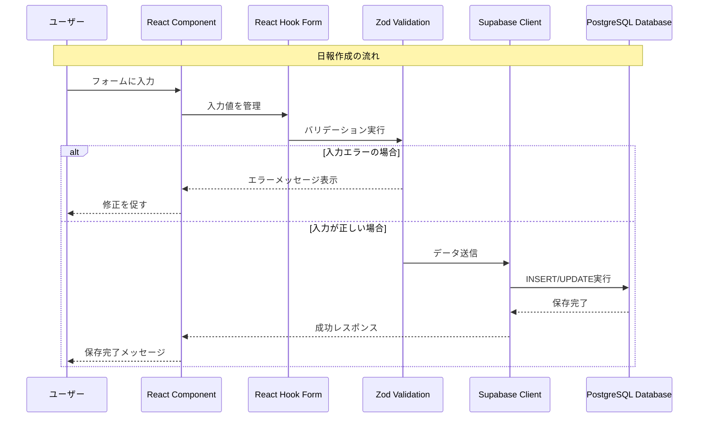

# Driver Logbook v3 技術仕様書

## 非エンジニア向け プロジェクト理解ガイド

---

## 🎯 1. プロジェクト概要

### 📝 目的と機能

**Driver Logbook v3**は、委託ドライバーの日々の業務を効率化する Web アプリケーションです。

#### 解決する課題

- **手書き日報の煩雑さ** → デジタル入力で時間短縮
- **月次集計の手間** → 自動計算で作業軽減
- **レポート作成の困難** → PDF/CSV 出力で簡単提出

#### 主要機能

```
✅ ユーザー認証 - 安全なログイン・登録
✅ 日報管理 - 作成・編集・削除・一覧表示
✅ ダッシュボード - 月間統計の可視化
✅ 月次レポート - PDF/CSV形式での出力
✅ レスポンシブ対応 - スマホ・タブレット・PC対応
```

### 🛠️ 使用技術スタック

#### フロントエンド（ユーザーが見る部分）

| 技術             | 役割                 | 選択理由                         |
| ---------------- | -------------------- | -------------------------------- |
| **Next.js 14**   | React フレームワーク | 高速・SEO 対応・サーバー機能統合 |
| **TypeScript**   | 型安全な JavaScript  | バグ防止・開発効率向上           |
| **Tailwind CSS** | スタイリング         | 効率的なデザイン開発             |
| **shadcn/ui**    | UI コンポーネント    | 美しく統一されたデザイン         |

#### バックエンド（データ処理・保存）

| 技術                   | 役割               | 選択理由                  |
| ---------------------- | ------------------ | ------------------------- |
| **Supabase**           | データベース・認証 | PostgreSQL + 認証機能統合 |
| **Row Level Security** | データ保護         | ユーザー毎のデータ分離    |
| **Vercel**             | ホスティング       | 自動デプロイ・高速配信    |

#### 特殊機能

| 技術          | 役割       | 選択理由                   |
| ------------- | ---------- | -------------------------- |
| **jsPDF**     | PDF 生成   | ブラウザ内でのレポート作成 |
| **PapaParse** | CSV 処理   | Excel 互換データ出力       |
| **Zod**       | データ検証 | 厳密な入力チェック         |

---

## 🏗️ 2. システム構成図

### 📁 フォルダ構造

```typescript
// ファイル構造の説明
src/
├── app/                    # ページ（Next.js App Router）
│   ├── (auth)/            # 認証関連ページ
│   │   ├── login/         # ログインページ
│   │   └── register/      # 新規登録ページ
│   ├── dashboard/         # ダッシュボード（メイン画面）
│   ├── reports/           # 日報関連ページ
│   │   ├── list/         # 日報一覧
│   │   ├── edit/[id]/    # 日報編集（IDで個別ページ）
│   │   └── monthly/      # 月次レポート
│   └── layout.tsx         # 全体レイアウト
├── components/            # 再利用可能な部品
│   ├── ui/               # 基本UI部品（ボタン、カードなど）
│   ├── forms/            # フォーム関連
│   └── layout/           # レイアウト部品
├── lib/                  # ビジネスロジック・ユーティリティ
│   ├── supabase/        # データベース接続・操作
│   ├── utils/           # 便利機能（PDF/CSV生成）
│   └── validations/     # 入力データ検証
├── types/               # TypeScript型定義
└── styles/              # スタイル設定
```

### 🗄️ データベース設計

```sql
-- メインテーブル構造

users (ユーザー情報)
├── id: ユーザーID（主キー）
├── email: メールアドレス
├── display_name: 表示名
└── created_at: 作成日時

daily_reports (日報データ)
├── id: 日報ID（主キー）
├── user_id: ユーザーID（外部キー）
├── date: 日付
├── is_worked: 稼働フラグ
├── start_time: 開始時間
├── end_time: 終了時間
├── start_odometer: 開始メーター
├── end_odometer: 終了メーター
├── distance_km: 距離（自動計算）
├── deliveries: 配送件数
├── highway_fee: 高速料金
└── notes: 備考
```

#### 🔐 セキュリティ設計

```sql
-- Row Level Security (RLS) の例
-- ユーザーは自分のデータのみアクセス可能
CREATE POLICY "users_own_data" ON daily_reports
  FOR ALL USING (auth.uid() = user_id);
```

---

## 🔄 3. データフロー解説

### 👤 ユーザー操作からデータ処理まで

#### 例：日報作成の完全フロー

```typescript
// 1. ユーザーがフォームに入力
// components/forms/DailyReportForm.tsx
export function DailyReportForm() {
  const { user } = useAuth(); // 🔐 認証情報取得
  const form = useForm({
    // 📝 フォーム状態管理
    resolver: zodResolver(schema), // ✅ バリデーション設定
  });

  const onSubmit = async (data) => {
    // 2. バリデーション → 3. データベース保存
    await upsertDailyReport({
      ...data,
      user_id: user.id,
    });
  };
}
```

```typescript
// lib/supabase/queries/daily-reports.ts
export async function upsertDailyReport(data) {
  // 4. Supabaseクライアント経由でデータベースに送信
  const { data: result, error } = await supabase
    .from('daily_reports')
    .upsert(data)
    .select();

  if (error) throw error;
  return result;
}
```

### 📡 API 通信の流れ



### 🔄 状態管理の仕組み

```typescript
// contexts/AuthContext.tsx - 認証状態をアプリ全体で共有
export function AuthProvider({ children }) {
  const [user, setUser] = useState(null); // ログイン中のユーザー
  const [loading, setLoading] = useState(true); // 読み込み状態

  // Supabaseの認証状態変化を監視
  useEffect(() => {
    supabase.auth.onAuthStateChange((event, session) => {
      setUser(session?.user || null);
      setLoading(false);
    });
  }, []);

  return (
    <AuthContext.Provider value={{ user, loading }}>
      {children}
    </AuthContext.Provider>
  );
}
```

### 🎯 重要な設計パターン

#### 1. Server/Client Components 分離

```typescript
// app/dashboard/page.tsx (Server Component)
export default async function DashboardPage() {
  // サーバーで初期データを取得（高速）
  const reports = await getDailyReports(userId);

  // クライアントコンポーネントにデータを渡す
  return <DashboardClient reports={reports} />;
}

// DashboardClient.tsx (Client Component)
('use client');
export function DashboardClient({ reports }) {
  // ユーザーとのインタラクション処理
  const [selectedReport, setSelectedReport] = useState();
  // ...
}
```

#### 2. 型安全なデータアクセス

```typescript
// types/database.ts - 厳密な型定義
export interface DailyReport {
  id: number; // 必須の数値
  user_id: string; // 必須の文字列
  date: string; // ISO日付形式
  is_worked: boolean; // 真偽値
  start_time?: string; // オプション（?付き）
  end_time?: string;
  // ...
}

// 実際の使用例
const report: DailyReport = await getDailyReportById(123);
//    ↑ TypeScriptが型をチェック
```

---

## 🔧 4. 技術解説

### ⚡ Next.js の特徴と使用理由

#### 🎯 Next.js 14 App Router の優位性

| 従来の React 開発      | Next.js 14 の改善                                 |
| ---------------------- | ------------------------------------------------- |
| 複雑なルーティング設定 | **ファイルベースルーティング** - フォルダ＝ページ |
| SEO 対策が困難         | **Server Side Rendering** - 検索エンジン最適化    |
| 初期表示が遅い         | **Static Generation** - 高速な初期ロード          |
| API サーバー別途必要   | **API Routes** - フロントと統合                   |

#### 🚀 実装例：ファイルベースルーティング

```typescript
// フォルダ構造が自動的にURLになる
src/app/reports/list/page.tsx     → /reports/list
src/app/reports/edit/[id]/page.tsx → /reports/edit/123 (動的ルート)
src/app/(auth)/login/page.tsx     → /login (グループ化)
```

#### 🎨 Server/Client Components

```typescript
// 🖥️ Server Component - サーバーで実行（高速・SEO対応）
export default async function ReportsPage() {
  const reports = await fetchReports(); // データベース直接アクセス
  return <ReportsList reports={reports} />;
}

// 💻 Client Component - ブラウザで実行（インタラクション）
('use client');
export function ReportsList({ reports }) {
  const [filter, setFilter] = useState('all'); // 状態管理
  // ユーザー操作に応じた動的処理
}
```

### 🔒 TypeScript の型定義

#### 💡 型安全性の価値

```typescript
// ❌ JavaScript（型なし）- エラーが発生しやすい
function updateReport(id, data) {
  // idが数値？文字列？dataに何が入っている？
  return supabase.from('daily_reports').update(data).eq('id', id);
}

// ✅ TypeScript（型あり）- エラーを事前に発見
function updateReport(
  id: number, // 数値のみ
  data: Partial<DailyReport> // DailyReportの一部のみ
): Promise<DailyReport> {
  // 戻り値も明確
  return supabase.from('daily_reports').update(data).eq('id', id);
}
```

#### 🎯 実践的な型定義例

```typescript
// types/database.ts
export interface DailyReport {
  id: number;
  user_id: string;
  date: string; // YYYY-MM-DD形式
  is_worked: boolean;
  start_time?: string; // HH:MM形式、オプション
  end_time?: string;
  // ...その他のフィールド
}

// フォーム用の型（IDなしバージョン）
export type CreateDailyReportData = Omit<DailyReport, 'id' | 'created_at'>;

// 更新用の型（すべてオプション）
export type UpdateDailyReportData = Partial<CreateDailyReportData>;
```

### 📚 主要ライブラリの役割

#### 📝 React Hook Form + Zod

```typescript
// 強力なフォーム管理 + バリデーション
const schema = z.object({
  date: z.string().min(1, '日付は必須です'),
  is_worked: z.boolean(),
  start_time: z
    .string()
    .regex(/^[0-2][0-9]:[0-5][0-9]$/, '正しい時刻形式で入力してください'),
});

const form = useForm({
  resolver: zodResolver(schema), // バリデーションルール適用
  defaultValues: {
    date: new Date().toISOString().split('T')[0],
    is_worked: false,
  },
});
```

#### 🎨 shadcn/ui + Tailwind CSS

```typescript
// 美しく統一されたUIコンポーネント
import { Button } from '@/components/ui/button';
import { Card, CardContent, CardHeader } from '@/components/ui/card';

export function DashboardCard() {
  return (
    <Card className="w-full max-w-md">
      <CardHeader>
        <h2 className="text-2xl font-bold">今月の統計</h2>
      </CardHeader>
      <CardContent>
        <Button variant="outline" size="lg">
          詳細を見る
        </Button>
      </CardContent>
    </Card>
  );
}
```

#### 📊 jsPDF + PapaParse

```typescript
// lib/utils/pdf-export.ts
export async function generateMonthlyPDF(reports: DailyReport[]) {
  const doc = new jsPDF();

  // 日本語フォント設定
  doc.setFont('helvetica', 'normal');

  // タイトル描画
  doc.text('月次業務レポート', 20, 20);

  // データテーブル描画
  reports.forEach((report, index) => {
    const yPosition = 40 + index * 10;
    doc.text(`${report.date}: ${report.distance_km}km`, 20, yPosition);
  });

  // ファイルダウンロード
  doc.save('月次レポート.pdf');
}
```

### 🔄 状態管理戦略

#### 🎯 React Context vs Props vs State

```typescript
// 1. Global State - 認証情報（全体で必要）
const AuthContext = createContext();

// 2. Component State - フォーム入力（局所的）
function DailyReportForm() {
  const [isSubmitting, setIsSubmitting] = useState(false);
}

// 3. Props - 親から子への情報伝達
function DashboardPage() {
  const reports = await getReports();
  return <ReportsList reports={reports} />; // Props として渡す
}
```

#### ⚡ パフォーマンス最適化

```typescript
// React.memo - 不要な再描画を防ぐ
export const ReportCard = React.memo(function ReportCard({ report }) {
  return <Card>...</Card>;
});

// useMemo - 重い計算をキャッシュ
function MonthlyStats({ reports }) {
  const statistics = useMemo(() => {
    return calculateMonthlyStats(reports); // 重い計算
  }, [reports]); // reportsが変わった時のみ再計算

  return <div>{statistics.totalDistance}km</div>;
}
```

---

## 🎯 プロジェクトの技術的価値

### 🏆 現代的な開発手法の習得

1. **型安全な開発** - TypeScript によるバグ予防
2. **コンポーネント設計** - 再利用可能な部品化
3. **パフォーマンス最適化** - Server/Client Components 分離
4. **セキュリティ重視** - RLS によるデータ保護
5. **CI/CD 実装** - Vercel 自動デプロイ

### 🚀 学習効果の高いポイント

#### 📈 段階的学習可能

```
Level 1: ファイル構造の理解
├── フォルダとURLの対応関係
├── コンポーネントの役割分担
└── props とstateの使い分け

Level 2: データフローの理解
├── フォーム → バリデーション → データベース
├── 認証状態の管理方法
└── エラーハンドリング戦略

Level 3: 設計パターンの理解
├── Server/Client Components の使い分け
├── カスタムフックの活用
└── 型定義の設計思想
```

### 💼 転職市場での価値

| 習得技術               | 市場需要   | 実証できる能力           |
| ---------------------- | ---------- | ------------------------ |
| **Next.js 14**         | ⭐⭐⭐⭐⭐ | モダンなフルスタック開発 |
| **TypeScript**         | ⭐⭐⭐⭐⭐ | 型安全な大規模開発       |
| **Supabase**           | ⭐⭐⭐⭐☆  | BaaS 活用・RLS 設計      |
| **認証・セキュリティ** | ⭐⭐⭐⭐⭐ | エンタープライズ対応     |

---

## 📖 学習のための次のステップ

### 🎯 基礎理解確認

- [ ] ファイル構造と役割を説明できる
- [ ] コンポーネント間のデータフローを図解できる
- [ ] 認証からデータ保存までの流れを理解できる

### 🔧 実装理解深掘り

- [ ] TypeScript 型定義の読み方・書き方
- [ ] React Hook Form + Zod の使用パターン
- [ ] Supabase クエリの最適化方法

### 🚀 応用・拡張実装

- [ ] 新機能を既存アーキテクチャに組み込む
- [ ] パフォーマンス課題の特定・改善
- [ ] テスト戦略の策定・実装

---

## 📝 まとめ

この技術仕様書により、**AI 駆動開発で作成されたプロジェクトでも、技術的本質を理解し、将来の拡張や改善に活用できる知識基盤**を構築できます。

### 重要なポイント

1. **段階的理解** - ファイル構造から設計パターンまで
2. **実践的な例** - 実際のコードと図解による説明
3. **技術選択の理由** - なぜその技術を使うのかの背景
4. **将来への橋渡し** - 学習継続と技術力向上の道筋

これらの理解により、Next.js/TypeScript の学習を効率的に進め、現代的な Web 開発の技術力を着実に身につけることができます。

---

**最終更新**: 2025 年 1 月 16 日  
**バージョン**: v1.0  
**対象読者**: Next.js/TypeScript 学習中の非エンジニア
